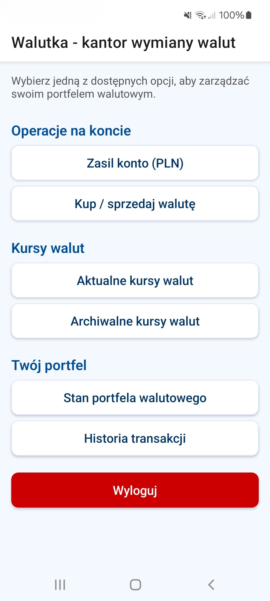
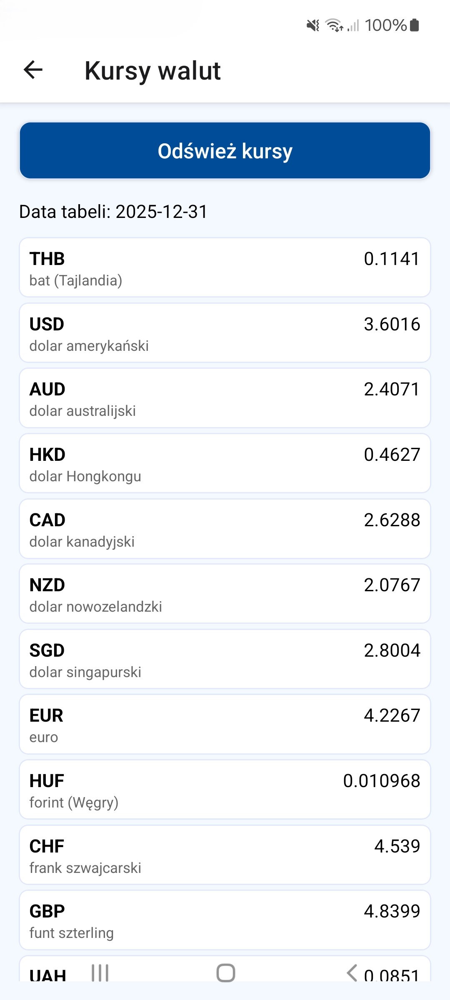
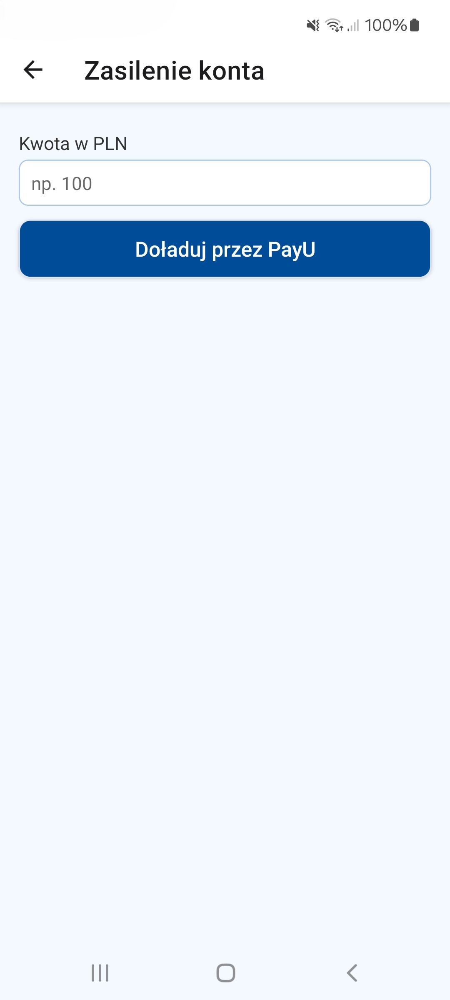

## Walutka – wirtualny kantor walut

  
  
  
  

## Opis
Walutka to aplikacja mobilna symulująca działanie wirtualnego kantoru walut.  
Umożliwia użytkownikom rejestrację, logowanie, zarządzanie wirtualnym portfelem oraz realizację transakcji kupna i sprzedaży walut na podstawie aktualnych kursów pobieranych z API NBP.

---

## Architektura
- **Aplikacja mobilna** – interfejs użytkownika
- **Web Service (Backend)** – logika biznesowa i API
- **Baza danych** – trwałe przechowywanie danych
- **Zewnętrzne API** – publiczne API Narodowego Banku Polskiego

Komunikacja odbywa się poprzez **REST API** z wykorzystaniem **HTTPS** i formatu **JSON**.

---

## Funkcjonalności
- Rejestracja i logowanie użytkownika
- Zasilenie konta wirtualnymi środkami
- Pobieranie aktualnych i archiwalnych kursów walut z API NBP
- Kupno i sprzedaż walut po aktualnym kursie
- Podgląd historii transakcji
- Podgląd stanu portfela walutowego

---

## Backend – odpowiedzialności
- Autoryzacja i uwierzytelnianie użytkowników
- Integracja z API NBP
- Walidacja danych wejściowych
- Przetwarzanie transakcji walutowych
- Zarządzanie danymi w bazie danych

---

## Baza danych
Aplikacja korzysta z relacyjnej bazy danych przechowującej:
- użytkowników
- salda portfeli walutowych
- historię transakcji
- aktualne i archiwalne kursy walut

---

## Instalacja i uruchomienie

### Wymagania
- Node.js (LTS)
- npm
- Expo CLI
- PowerShell

### Instalacja zależności
W katalogu "mobile" projektu:
powershell
npm install

### Uruchomienie backendu (terminal 1)

cd server >
node app.js

### Uruchomienie aplikacji mobilnej (terminal 2)

cd mobile >
npm start
